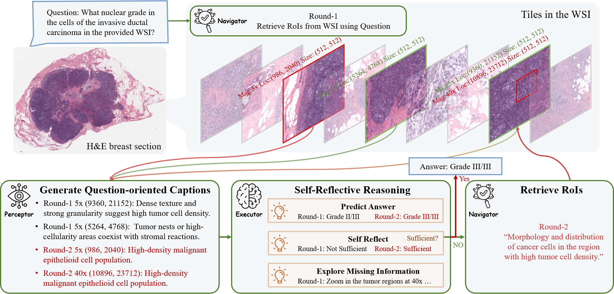
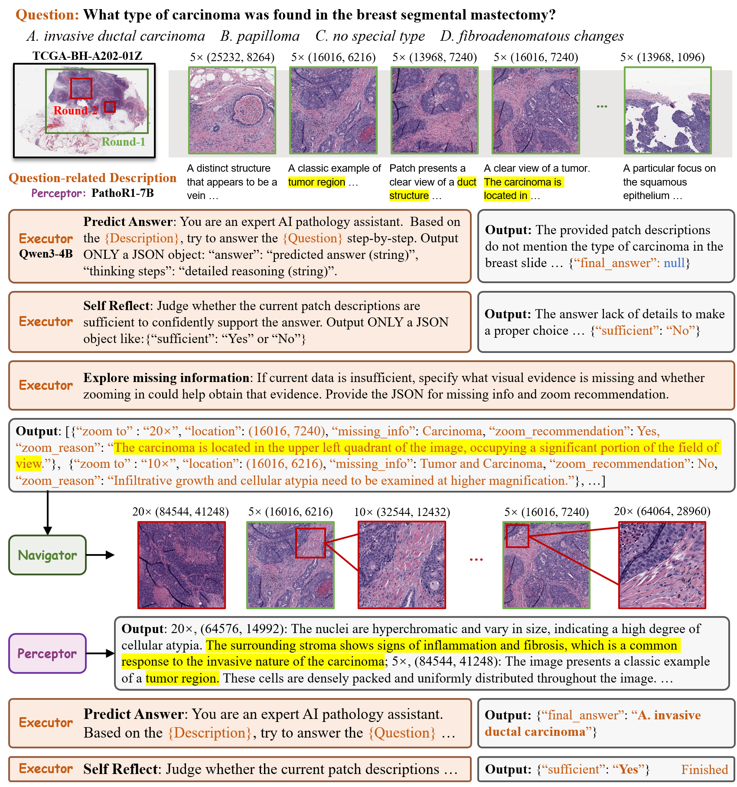

# PathAgent: Toward Interpretable Analysis of Whole-slide Pathology Images via Large Language Model-based Agentic Reasoning
[](https://github.com/G14nTDo4/PathAgent)
[](https://arxiv.org/abs/2511.17052)
[](https://arxiv.org/pdf/2511.17052.pdf)

<div align="center">

</div>

Official code implementation for paper "PathAgent: Toward Interpretable Analysis of Whole-slide Pathology Images via Large Language Model-based Agentic Reasoning"

>Jingyun Chen, Linghan Cai, Zhikang Wang, Yi Huang, Songhan Jiang, Shenjin Huang, Hongpeng Wang, Yongbing Zhang


## Overview

PathAgent is the first training-free interactive agent specifically designed for WSI analysis. By coordinating off-the-shelf pathology models through an agent, it yields traceable decisions and competitive accuracy, suggesting a pragmatic route of computational pathology.

The contributions of PathAgent can be summarized in three aspects:

1. Dynamic analytic Logic: We replace single-step reasoning with Multi-Step Reasoning in the Executor. This mechanism can construct analytic logic and dynamically provide guidelines to retrieve task-relevant information.
2. Adaptive Magnification: PathAgent can adaptively select an appropriate scale based on the analytic state, generating more refined visual evidence.
3. Enhanced Evidence Retrieval: We improve the accuracy of evidence capture by simplifying the query strategy of the Navigator.


<p align="center"><i>Overview of PathAgent</i></p>


<p align="center"><i>Illustration of PathAgent's inference procedure</i></p>

## 1. Installation 

```bash
git clone https://github.com/G14nTDo4/PathAgent.git
cd PathAgent
conda create -n pathagent python=3.9 -y
conda activate pathagent

# Install PyTorch (specify CUDA version)
pip install torch==2.7.0 torchvision==0.22.0 --index-url https://download.pytorch.org/whl/cu121
pip install -r requirements.txt
```

## 2. Data Preparation
The following steps take the WSI-VQA dataset as an example.

### 2.1 Patch Generation
Copy data_preparation_script/coordinate_generation.py to the [CLAM](https://github.com/mahmoodlab/CLAM) project directory, and use the following code to generate the patches.
```bash
cd CLAM_PROJECT_DIRECTORY
python coordinate_generation.py \
  --source DATA_DIRECTORY  \
  --save_dir /data/yuhaowang/processed_wsi/TCGA-BRCA/ \
  --preset tcga.csv \
  --step_size 4096 \
  --patch_size 4096 \
  --patch \
  --seg \
```


```
cd ./CLAM
python coordinate_generation.py \
  --source /data/yuhaowang/TCGA-ALL/TCGA-BRCA/WSI  \
  --save_dir /data/yuhaowang/processed_wsi/TCGA-BRCA \
  --preset tcga.csv \
  --step_size 4096 \
  --patch_size 4096 \
  --patch \
  --seg \
```


```
cd ./CLAM
python coordinate_generation.py \
  --source /data2/yuhaowang/BCNB/WSIs_tiff/  \
  --save_dir /data2/yuhaowang/processed_wsi/slidebench \
  --preset tcga.csv \
  --step_size 4096 \
  --patch_size 4096 \
  --patch \
  --seg 
```

The DATA_DIRECTORY is the storage directory for svs files.
```bash
DATA_DIRECTORY/
	├── slide_1.svs
	├── slide_2.svs
	└── ...
```

The above command will segment every slide in DATA_DIRECTORY and generate the following folder structure at the specified /data/yuhaowang/processed_wsi/TCGA-BRCA/:
```bash
/data/yuhaowang/processed_wsi/TCGA-BRCA//
	├── masks
    		├── slide_1.png
    		├── slide_2.png
    		└── ...
	├── patches
    		├── slide_1.h5
    		├── slide_2.h5
    		└── ...
	├── stitches
    		├── slide_1.png
    		├── slide_2.png
    		└── ...
	└── process_list_autogen.csv
```

Using the h5 file in /data/yuhaowang/processed_wsi/TCGA-BRCA/, we can extract the patch from WSI.
```bash
python data_preparation_script/patch_generation.py \
  --h5_dir /data/yuhaowang/processed_wsi/TCGA-BRCA//patches \
  --slide_dir DATA_DIRECTORY \
  --output_root /data/yuhaowang/processed_wsi/TCGA-BRCA//patches_output \
  --patch_size 4096
```


```bash
python data_preparation_script/patch_generation.py \
  --h5_dir /data2/yuhaowang/processed_wsi/slidebench/patches/ \
  --slide_dir /data2/yuhaowang/BCNB/WSIs_tiff/ \
  --output_root /data2/yuhaowang/processed_wsi/slidebench/patches_output \
  --patch_size 4096
```

The above command will generate the following folder structure at the specified /data/yuhaowang/processed_wsi/TCGA-BRCA//patches_output:
```bash
/data/yuhaowang/processed_wsi/TCGA-BRCA//patches_output/
	├── slide_1
    		├── 0_23904.png
    		├── 4096_28000.png
    		└── ...
	├── slide_2
    		├── 4128_7296.png
    		├── 4128_11392.png
    		└── ...
	└── ...
```

### 2.2 Description Generation
Before generating the description, we first need to modify the Quilt-LLaVA system prompt, replacing quilt-llava/llava/conversation.py with data_preparation_script/conversation_pathology_v0.py. Please note that the final file name is still conversation.py. The different name is only to distinguish the file from the file in the [Quilt-LLaVA](https://github.com/aldraus/quilt-llava) project.

Multiple processes can be executed simultaneously to speed up the description generation process, which is also very user-friendly for users with limited VRAM. Only the description files for each block need to be concatenated at the end. Here, we divide all WSIs in the test set into four equal parts. Readers can adjust the number of parts as needed.
```bash
python data_preparation_script/split_files.py \
  --image_dir /data/yuhaowang/processed_wsi/TCGA-BRCA/patches_output \
  --save_dir /data/yuhaowang/processed_wsi/TCGA-BRCA/split_name \
  --num_splits 4
```


```bash
python data_preparation_script/split_files.py \
  --image_dir /data2/yuhaowang/processed_wsi/slidebench/patches_output \
  --save_dir /data2/yuhaowang/processed_wsi/slidebench/split_name \
  --num_splits 4
```


The above command will generate the following folder structure at the specified /data/yuhaowang/processed_wsi/TCGA-BRCA//split_name:
```bash
/data/yuhaowang/processed_wsi/TCGA-BRCA//split_name/
	├── slides_part1.txt
	├── slides_part2.txt
	└── ...
```

Copy data_preparation_script/description_generation.py and data_preparation_script/multi_description_generation.sh to the Quilt-LLaVA project directory, and use the following code to generate the description.
```bash
cd Quilt_LLaVA_DIRECTORY
bash multi_description_generation.sh
```

The above command will generate the following folder structure at the specified /data/yuhaowang/processed_wsi/TCGA-BRCA//desc:
```bash
/data/yuhaowang/processed_wsi/TCGA-BRCA//desc/
	├── patches_descriptions1.json
	├── patches_descriptions2.json
	├── patches_descriptions3.json
	└── patches_descriptions4.json
```

The following command is used to merge all JSON files in the desc folder into a single JSON file.
```bash
python data_preparation_script/merge_json_results.py --input_dir /data/yuhaowang/processed_wsi/TCGA-BRCA/desc  --output_file /data/yuhaowang/processed_wsi/TCGA-BRCA/desc/patches_descriptions.json 
```

### 2.3 Patch Embeddings Generation
Copy data_preparation_script/img_emb_generation.py and data_preparation_script/multi_emb_generation.sh to the [PLIP](https://github.com/PathologyFoundation/plip) project directory, and use the following code to generate the Embeddings.
```bash
cd PLIP_PROJECT_DIRECTORY
bash multi_emb_generation.sh
```

The above command will generate the following folder structure at the specified /data/yuhaowang/processed_wsi/TCGA-BRCA//img_features:
```bash
/data/yuhaowang/processed_wsi/TCGA-BRCA//img_features/
	├── slide_1
    		├── 0_23904.npy
    		├── 4096_28000.npy
    		└── ...
	├── slide_2
    		├── 4128_7296.npy
    		├── 4128_11392.npy
    		└── 
        ...
	└── ...
```

## 3. Inference

### 3.1 Baseline Inference (No Memory)

```bash
CUDA_VISIBLE_DEVICES=0,1,2,3,4,5,6,7 python pathagento.py \
    --gpu_ids 0,1,2,3,4,5,6,7 \
    --plip_lib_path ./plip \
    --qwen_ckpt /data/yuhaowang/cache/qwen3b/ \
    --procs_per_gpu 2 \
    --plip_ckpt /data/yuhaowang/cache/plip \
    --patho_r1_ckpt /data/yuhaowang/cache/Patho-R1-7B \
    --descriptions_file /data/yuhaowang/processed_wsi/TCGA-BRCA/desc/patches_descriptions.json \
    --questions_file /data/yuhaowang/wsi-vqa/WsiVQA_test.json \
    --feature_dir /data/yuhaowang/processed_wsi/TCGA-BRCA/img_features \
    --patch_root /data/yuhaowang/processed_wsi/TCGA-BRCA/patches_output \
    --save_dir /data/yuhaowang/processed_wsi/TCGA-BRCA/results/pathagent

```

### 3.2 Memory-Guided PathAgent (Train Build -> Test Inference)

The memory branch now follows the paper logic directly:
1. Run the training split with `--memory_mode build` to construct a read-only diagnostic memory bank.
2. Run the test split with `--memory_mode inference` to retrieve prototypes from that bank.
3. Evaluate the test results.

`pathagent.py` is the unified entry point. `test.py` is a convenience wrapper that runs the two stages in sequence.


#### Step 4: Evaluate test results

```bash
python eval/metics.py --results_dir /data/yuhaowang/processed_wsi/TCGA-BRCA/results/memory_inference_test
```


### build memory
```
CUDA_VISIBLE_DEVICES=0,1,2,3,4,5,6,7 python pathagent.py \
    --mode build_memory \
    --memory_enabled \
    --gpu_ids 0,1,2,3,4,5,6,7 \
    --plip_lib_path ./plip \
    --qwen_ckpt /data/yuhaowang/cache/qwen3b/ \
    --procs_per_gpu 2 \
    --plip_ckpt /data/yuhaowang/cache/plip \
    --patho_r1_ckpt /data/yuhaowang/cache/Patho-R1-7B \
    --descriptions_file /data2/yuhaowang/processed_wsi/slidebench/desc/patches_descriptions.json \
    --questions_file /data/yuhaowang/wsi-vqa/WsiVQA_train.json \
    --feature_dir /data2/yuhaowang/processed_wsi/slidebench/img_features \
    --patch_root /data2/yuhaowang/processed_wsi/slidebench/patches_output \
    --save_dir /data2/yuhaowang/processed_wsi/slidebench/results/pathagent_memory_train \
    --memory_bank_path /data2/yuhaowang/processed_wsi/slidebench/results/pathagent_memory_train/memory_bank.json \
    --visual_weight 0.75 \
    --desc_weight 0.25 \
    --memory_lambda 0.5 \
    --memory_topk_phase1 12 \
    --memory_topk_phase2 3 \
    --memory_sim_threshold 0.15 \
    --memory_update_alpha 0.3
```
## 4. Evaluation

```bash
python eval/metics.py --results_dir /data/yuhaowang/processed_wsi/TCGA-BRCA/results/pathagent_memory_test/
```


## Citation
```bibtex
@article{chen2025pathagent,
      title={PathAgent: Toward Interpretable Analysis of Whole-slide Pathology Images via Large Language Model-based Agentic Reasoning}, 
      author={Jingyun Chen and Linghan Cai and Zhikang Wang and Yi Huang and Songhan Jiang and Shenjin Huang and Hongpeng Wang and Yongbing Zhang},
      journal={arXiv preprint arXiv:2511.17052},
      year={2025}
}
```


GPU_IDS=0,1,2,3,4,5,6,7 WORKERS_PER_GPU=2 \
bash run_memory_pipeline.sh all 2>&1 | tee output.log
